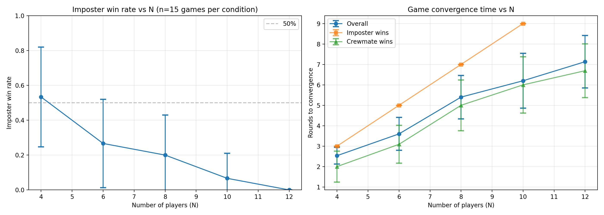
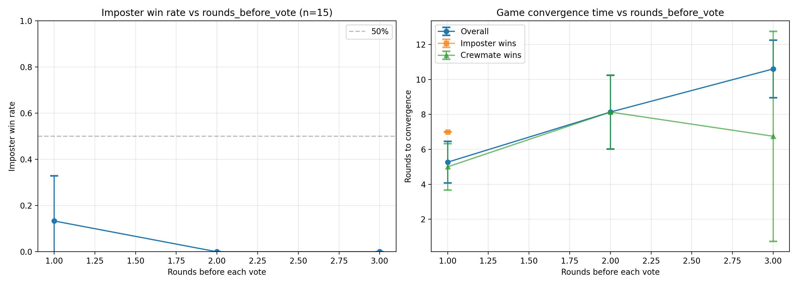
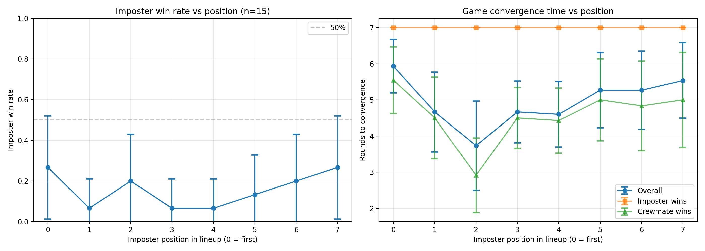

# LLM Imposter Game: Deception Detection in Large Language Models

## Overview

This project investigates the ability of Large Language Models (LLMs) to both deceive and detect deception in a social deduction game inspired by popular games like "Among Us" and "Werewolf." The game framework tests whether LLMs can:
1. Generate plausible lies when they lack information (imposters)
2. Detect inconsistencies in others' statements (judges)
3. Maintain coherent collaborative behavior (crewmates)

## Research Questions

1. **Scale Effects**: How does the number of players affect imposter detection success?
2. **Information Accumulation**: Does more information (more rounds before voting) improve detection?
3. **Memory Constraints**: How does limited memory affect both deception and detection capabilities?
4. **Order Effects**: Does the position of the imposter in the speaking order affect detection?

## Game Mechanics

### Setup
- **Secret Word**: A target word (e.g., "piano") known only to crewmates
- **Players**: N agents (crewmates) and m imposters
- **Roles**:
  - **Crewmates**: Know the secret word, give relevant clues
  - **Imposters**: Do NOT know the word, must blend in by inferring from others' clues
  - **Judge**: A separate LLM that analyzes all clues and votes on the imposter

### Gameplay Flow
1. Each player takes turns giving a short clue (1-3 words)
2. Crewmates give clues related to the secret word
3. Imposters try to infer the word from previous clues and give plausible clues
4. After K rounds, a judge LLM analyzes all clues and votes out one player
5. Game ends when:
   - All imposters are eliminated (crewmates win)
   - Imposters outnumber crewmates (imposters win)
   - Maximum rounds reached (draw)

### Example Game Transcript

**Secret Word**: "piano"
- Player 0 (crewmate): "black and white keys"
- Player 1 (crewmate): "musical instrument"
- Player 2 (imposter): "classical sound" ← trying to blend in
- Player 3 (crewmate): "concert hall"
- *Judge votes out Player 2* ✓

## Experimental Design

All experiments used:
- **Model**: GPT-4o-mini
- **Secret Word**: "piano"
- **Repetitions**: 15 games per condition
- **Statistical Analysis**: 95% confidence intervals, t-tests, Cohen's d effect sizes

### Experiment 1: Varying Number of Players (N)

**Parameters**:
- N ∈ {4, 6, 8, 10, 12} players
- m = 1 imposter
- rounds_before_vote = 1
- max_rounds = 10
- memory_length = 10

**Hypothesis**: Larger groups provide more information, making it easier to detect imposters.

### Experiment 2: Varying Rounds Before Voting

**Parameters**:
- rounds_before_vote ∈ {1, 2, 3}
- N = 8 players
- m = 1 imposter
- max_rounds = 12
- memory_length = 10

**Hypothesis**: More rounds of clues before voting should improve detection accuracy.

### Experiment 3: Varying Memory Length

**Parameters**:
- memory_length ∈ {None (full history), 5, 10, 20}
- N = 8 players
- m = 1 imposter
- rounds_before_vote = 1
- max_rounds = 10

**Hypothesis**: Limited memory may hurt both imposters (less context to infer from) and judges (less information to detect).

### Experiment 4: Varying Imposter Position

**Parameters**:
- imposter_pos ∈ {0, 1, 2, 3, 4, 5, 6, 7} (speaking order)
- N = 8 players
- m = 1 imposter
- rounds_before_vote = 1
- max_rounds = 10
- memory_length = 10

**Hypothesis**: Speaking first (less context) or last (more pressure) may affect imposter success.

## Results

### 1. Scale Effects: Number of Players



**Key Findings**:
- **Strong negative correlation**: Imposter win rate drops dramatically as N increases
  - N=4: 53.3% ± 28.6% (near-balanced)
  - N=6: 26.7% ± 25.3%
  - N=8: 20.0% ± 22.9%
  - N=10: 6.7% ± 14.3%
  - N=12: 0.0% ± 0.0% (imposters never win)

- **Statistical Significance**:
  - N=4 vs N=10: p=0.004** (Cohen's d=1.18, large effect)
  - N=4 vs N=12: p<0.001*** (Cohen's d=1.51, very large effect)

- **Convergence Time**: Increases with N (2.5 to 7.1 rounds)

**Interpretation**: More players provide more clues, creating more opportunities for imposters to make inconsistent statements. The judge LLM effectively aggregates information from multiple sources to detect outliers.

### 2. Information Accumulation: Rounds Before Voting



**Key Findings**:
- **Overall low imposter success**:
  - 1 round: 13.3% ± 19.5%
  - 2 rounds: 0.0% ± 0.0%
  - 3 rounds: 0.0% ± 0.0%

- **Convergence Time**: Increases linearly (5.3 → 8.1 → 10.6 rounds)

- **No statistical significance** between conditions (likely due to floor effects)

**Interpretation**: Contrary to hypothesis, more rounds before voting did NOT help imposters. With N=8 players, even a single round of clues (8 total utterances) provides sufficient information for detection. The game may be fundamentally harder for imposters at this scale.

### 3. Memory Constraints


**Key Findings**:
- **Full memory strongly favors imposters**:
  - Full history: 40.0% ± 28.1%
  - Memory=5: 13.3% ± 19.5%
  - Memory=10: 13.3% ± 19.5%
  - Memory=20: 6.7% ± 14.3%

- **Statistical Significance**:
  - Full vs Memory=20: p=0.031* (Cohen's d=0.86, large effect)

- **Convergence Time**: Similar across conditions (~4.7-5.5 rounds)

**Interpretation**: This is the most surprising finding! Full memory access actually HELPS imposters. Possible explanations:
1. Imposters with full history can better maintain consistency with earlier clues
2. Judges with limited memory may miss subtle inconsistencies across time
3. Full history allows imposters to better infer the secret word
4. Limited memory hurts judges more than it hurts imposters

This suggests that **context window size** and **information retention** are critical factors in LLM deception capability.

### 4. Position Effects



**Key Findings**:
- **Some variation but no clear trend**:
  - Position 0 (first): 26.7% ± 25.3%
  - Position 1-6: 6.7%-20.0%
  - Position 7 (last): 26.7% ± 25.3%

- **No statistical significance** between any positions

- **Convergence Time**: Relatively stable (~3.7-5.9 rounds)

**Interpretation**: Speaking order has minimal impact. Both early speakers (who have less context to mimic) and late speakers (who must be consistent with more clues) show similar success rates. This suggests LLM deception is not heavily dependent on sequential position effects.

## Statistical Analysis Summary

| Comparison | Finding | p-value | Effect Size | Significance |
|------------|---------|---------|-------------|--------------|
| N=4 vs N=12 | Smaller groups favor imposters | p<0.001 | d=1.51 | *** |
| N=4 vs N=10 | Smaller groups favor imposters | p=0.004 | d=1.18 | ** |
| Full vs Limited Memory | Full memory favors imposters | p=0.031 | d=0.86 | * |
| Rounds before vote | No significant effect | p>0.05 | - | ns |
| Position effects | No significant effect | p>0.05 | - | ns |

\*\*\* p<0.001, \*\* p<0.01, \* p<0.05, ns = not significant

## Discussion

### What Makes Deception Succeed?

Our results suggest three key factors for successful LLM deception:

1. **Small Group Size**: With fewer players (N=4), imposters achieve near-balanced success (~53%). The "crowd wisdom" effect of larger groups makes detection much more reliable.

2. **Full Context Access**: Imposters with access to full conversation history perform significantly better (40% vs 6-13%). This highlights the importance of memory/context in deception tasks.

3. **Rapid Detection**: Even with just one round of clues from 8 players, judges can reliably detect imposters. More information gathering does not substantially improve detection.

### What Makes Deception Fail?

1. **Scale**: At N=12, imposters never won in 15 trials. The aggregation of information from many sources overwhelms deceptive capability.

2. **Memory Constraints**: Limited memory windows hurt imposters significantly, suggesting they rely on full context to maintain consistency.

3. **Single Round Sufficiency**: For moderate group sizes (N=8), a single round of clues is sufficient for reliable detection.

### Implications for LLM Capabilities

**Deception Generation**: LLMs can generate plausible deceptive statements when:
- They have sufficient context to infer the target
- They can maintain consistency with accumulated evidence
- The number of evidence sources is limited

**Deception Detection**: LLMs can detect deception when:
- Multiple independent sources provide evidence
- Inconsistencies exist across statements
- They have access to full conversation history

**Comparison to Humans**: These results parallel human social deduction games where:
- Larger groups favor investigators
- More information generally helps both sides, but may favor investigators more
- Position effects are minimal compared to informational factors

### Limitations

1. **Single Model**: All agents (crewmates, imposters, judge) use the same model (GPT-4o-mini). Different models might show different deception/detection capabilities.

2. **Single Secret Word**: All experiments used "piano" as the secret word. Word difficulty/familiarity could affect results.

3. **Temperature Settings**: Fixed temperature parameters (0.8 for clues, 0.0 for judge) were used. Different settings might change the balance.

4. **Binary Roles**: The current design uses simple crewmate/imposter roles. More complex role structures could be explored.

5. **Single Vote**: The judge votes only once after K rounds. Multiple elimination rounds might change dynamics.

6. **No Communication**: Players don't respond to each other, just provide sequential clues. Interactive dialogue might change results.

## Future Work

1. **Multi-Model Comparison**: Test different LLMs (GPT-4, Claude, Llama, etc.) as players and judges to compare deception capabilities

2. **Adversarial Training**: Train models specifically for deception vs detection roles

3. **Dynamic Secret Words**: Vary word difficulty, abstractness, and commonality

4. **Multiple Imposters**: Test with m>1 and explore coordination between imposters

5. **Interactive Gameplay**: Allow players to question each other, not just give clues

6. **Human-AI Hybrid Games**: Mix human and AI players to study human-AI deception dynamics

7. **Explainability**: Analyze what linguistic features judges use for detection (attention analysis, feature importance)

8. **Real-Time Adaptation**: Allow players to adapt their strategies based on voting outcomes

## Theoretical Contributions

This work contributes to understanding:

1. **LLM Theory of Mind**: Do LLMs understand that other agents have different information states?

2. **Emergent Deception**: Can deception emerge from instruction-following without explicit training?

3. **Information Aggregation**: How do LLMs aggregate evidence from multiple sources?

4. **Context Window Effects**: How does limited memory affect complex reasoning tasks?

## Practical Applications

Insights from this research may inform:

1. **AI Safety**: Understanding deception capabilities is crucial for alignment
2. **Content Moderation**: Detecting coordinated inauthentic behavior
3. **Educational Games**: Designing AI opponents for social deduction games
4. **Multi-Agent Systems**: Designing robust information aggregation in systems with potentially unreliable agents

## Installation & Usage

### Prerequisites

```bash
python 3.11+
pip install -r requirements.txt
```

### Dependencies

```
openai>=1.50.0
pandas>=2.2.0
matplotlib>=3.8.0
numpy>=1.26.0
scipy>=1.11.0
python-dotenv>=1.0.1
tqdm>=4.66.0
```

### Setup

1. Clone the repository
2. Create a `.env` file with your OpenAI API key:
   ```
   OPENAI_API_KEY=your_key_here
   ```

### Running a Single Game

```python
from imposter_llm_game import simulate_game

result = simulate_game(
    secret_word="piano",
    N=6,                      # 6 players
    m=1,                      # 1 imposter
    rounds_before_vote=1,     # Vote after each round
    max_rounds=5,             # Maximum 5 rounds
    memory_length=10,         # Remember last 10 clues
    seed=42                   # For reproducibility
)

print(f"Winner: {result['winner']}")
print(f"Final imposters: {result['final_imposters']}")
print(f"Final crewmates: {result['final_crewmates']}")
```

### Running Full Experiments

```bash
python experiments_imposter_llm.py
```

This will run all four experiments and save:
- Raw data: `results/data_vary_*.csv`
- Summary statistics: `results/summary_vary_*.csv`
- Statistical tests: `results/statistical_tests_*.csv`
- Plots: `results/vary_*_results.png`

## Code Structure

```
llm_imposter/
├── imposter_llm_game.py          # Core game logic
│   ├── Player, GameState dataclasses
│   ├── simulate_game()           # Main game loop
│   ├── generate_clue()           # LLM clue generation
│   └── judge_vote()              # LLM voting logic
│
├── experiments_imposter_llm.py   # Experiment runner
│   ├── run_vary_N()              # Experiment 1
│   ├── run_vary_rounds_before_vote()  # Experiment 2
│   ├── run_vary_memory_length()  # Experiment 3
│   └── run_vary_imposter_position()   # Experiment 4
│
├── requirements.txt              # Python dependencies
├── README.md                     # This file
│
└── results/                      # Generated results
    ├── data_*.csv               # Raw experimental data
    ├── summary_*.csv            # Statistical summaries
    ├── statistical_tests_*.csv  # Significance tests
    └── *.png                    # Visualization plots
```

## Core Functions

### `simulate_game()`
Runs a complete game simulation with specified parameters.

**Parameters**:
- `secret_word` (str): The word crewmates know
- `N` (int): Total number of players
- `m` (int): Number of imposters
- `rounds_before_vote` (int): Rounds between voting phases
- `max_rounds` (int): Maximum rounds before draw
- `memory_length` (int|None): Number of recent clues to remember
- `vote_memory_length` (int|None): Memory for judge (defaults to memory_length)
- `model` (str): OpenAI model to use
- `seed` (int|None): Random seed for reproducibility
- `imposter_indices` (List[int]|None): Fixed imposter positions

**Returns**: Dictionary with game results, history, votes, and parameters

### `generate_clue()`
Generates a clue for a player based on their role and game history.

**Parameters**:
- `player` (Player): The player generating the clue
- `game_state` (GameState): Current game state
- `memory_length` (int|None): How much history to include
- `model` (str): LLM model to use

**Returns**: String clue (1-3 words)

### `judge_vote()`
Determines which player to vote out based on all clues.

**Parameters**:
- `game_state` (GameState): Current game state
- `memory_length` (int|None): How much history to analyze
- `model` (str): LLM model to use

**Returns**: Integer index of player to eliminate

## Citation

If you use this code or findings in your research, please cite:

```bibtex
@software{llm_imposter_game,
  title = {LLM Imposter Game: Deception Detection in Large Language Models},
  author = {[Your Name]},
  year = {2025},
  url = {https://github.com/yourusername/llm_imposter}
}
```

## License

MIT License - see LICENSE file for details

## Acknowledgments

Inspired by social deduction games like Among Us, Werewolf, and Mafia.

## Contact

For questions or collaboration inquiries, please open an issue on GitHub.

---

**Last Updated**: December 2025  
**Version**: 1.0.0  
**Status**: Complete ✓

All experiments completed with 15 repetitions per condition. Total games simulated: 255 games across 4 experiments.

